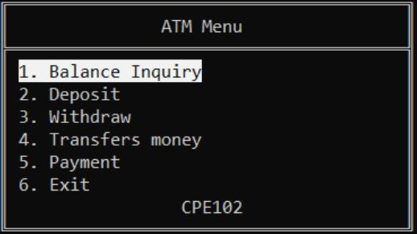
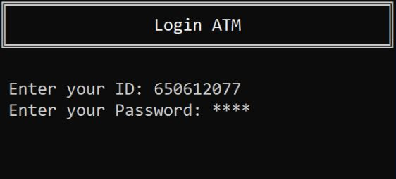

# **ATM Simulator Program - พา C++ ไป skrt**
## **Member**
1. 650612077 - ก๋อง กันใจ         
2. 650612079 - กิตติวัฒน์ ยะสารวรรณ   
3. 650612080 - ชนัญชิดา ถาวรวงค์    
4. 650612085 - ธิฆัมพร ลักษณะโภคิน 
5. 650612100 - ศุภกร สุวรรณภพ   
6. 650612101 - สันต์ทศน์ เขียวอุบล  

## **Description**
ATM Simulator Program using C++. Designed to simulate the core functionalities of an Automated Teller Machine (ATM). The program provides a terminal interface for performing essential banking operations, including account registration, authentication, balance inquiries, deposits, withdrawals, fund transfers, and payments.

## **Features**
- Sign-In & Login: Secure account creation and authentication.
- Balance Inquiry: View available account balance.
- Deposit: Add funds to the account.
- Withdraw: Withdraw cash while ensuring sufficient balance.
- Transfer Money: Send funds to another user’s account.
- Payment: Make payments to predefined services or accounts.

<!-- BLOG-POST-LIST:START -->
<!-- BLOG-POST-LIST:END -->

## **Presentation**
https://www.canva.com/design/DAFdVVXE_to/MySXE77TwoTl-qXGAbbebw/edit?utm_content=DAFdVVXE_to&utm_campaign=designshare&utm_medium=link2&utm_source=sharebutton
